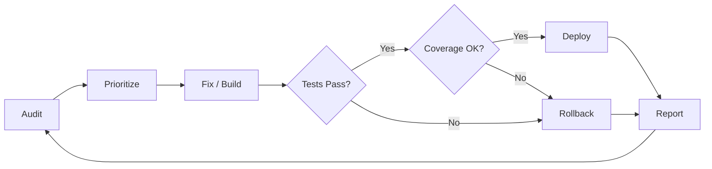
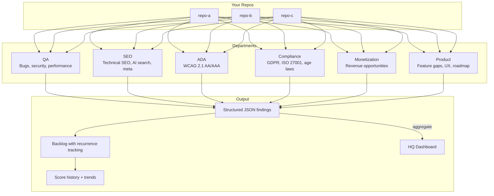
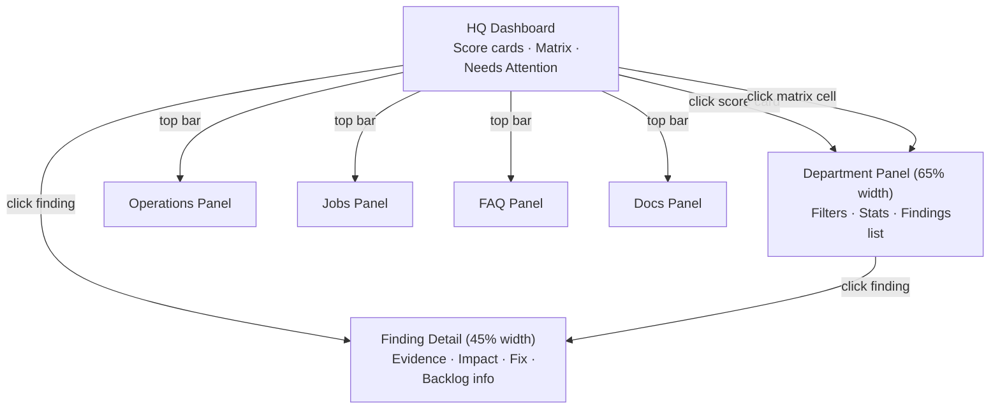
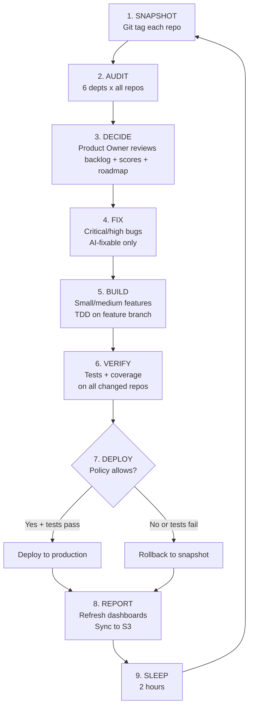
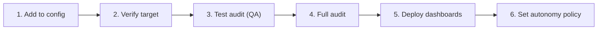
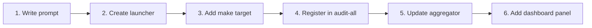

# Back Office

**Autonomous multi-repo engineering operations. Privacy-first. Human-centered. Audit, prioritize, fix, build, verify, deploy — on repeat.**

Back Office is an AI-powered operating system that runs six specialized departments against your entire portfolio of codebases. It finds bugs, checks accessibility, audits compliance, evaluates SEO, identifies revenue opportunities, and builds product roadmaps — then fixes what it can, deploys what passes, and tracks what remains across cycles.

**Built on three principles:**
- **Privacy first** — user data is minimized, encrypted, and never exploited. Privacy violations are treated as bugs, not suggestions.
- **Human-centered AI** — AI augments human judgment, never replaces it. Every AI decision is transparent, explainable, and overridable.
- **Accessible by default** — every product must work for people with disabilities. Accessibility is a core value, not a compliance checkbox.

---

## Table of Contents

- [Why Back Office](#why-back-office)
  - [Speed with Safety](#speed-with-safety)
  - [ROI per Cycle](#roi-per-cycle)
  - [The Backlog Never Lies](#the-backlog-never-lies)
- [How It Works](#how-it-works)
  - [Six Departments](#six-departments)
  - [Objective vs Advisory Findings](#objective-vs-advisory-findings)
- [Quick Start](#quick-start)
  - [1. Install](#1-install)
  - [2. Configure Targets](#2-configure-targets)
  - [3. Run an Audit](#3-run-an-audit)
  - [4. View the Dashboard](#4-view-the-dashboard)
  - [5. Deploy Dashboards](#5-deploy-dashboards)
- [The Dashboard](#the-dashboard)
  - [HQ Overview](#hq-overview)
  - [Slide-Over Panels](#slide-over-panels)
  - [Operations Panel](#operations-panel)
  - [Data Flow](#data-flow)
- [The Overnight Loop](#the-overnight-loop)
  - [How It Works](#how-the-loop-works)
  - [The Product Owner](#the-product-owner)
  - [Safety Gates](#safety-gates)
  - [Start / Monitor / Stop](#start--monitor--stop)
  - [Morning Review](#morning-review)
- [Per-Target Autonomy Policy](#per-target-autonomy-policy)
- [Rollback](#rollback)
- [Adding a New Project](#adding-a-new-project)
- [Adding a New Department](#adding-a-new-department)
- [Dual-Backend Support](#dual-backend-support)
- [Command Reference](#command-reference)
  - [Python CLI](#python-cli)
  - [Make Targets](#make-targets)
- [Architecture](#architecture)
  - [Package Structure](#package-structure)
  - [Key Files](#key-files)
- [CI/CD](#cicd)
- [Governance](#governance)

---

## Why Back Office

### Speed with Safety

Software teams face a constant tension: move fast or move carefully. Back Office eliminates this tradeoff by making every autonomous change a **two-way door**:

- Every cycle starts with a **git tag snapshot** — rollback is one command
- Every fix runs in an **isolated git worktree** — main branch stays clean until tests pass
- Every feature builds on a **separate branch** — merged only after verification
- Every deploy is **gated by tests and coverage** — if quality drops, the change is discarded
- The system **gets better over time** — each cycle adds to the test suite, expanding the safety net for future changes



### ROI per Cycle

Each overnight cycle produces measurable improvements:

| What happens | Business impact |
|---|---|
| Critical bugs fixed automatically | Fewer production incidents, less firefighting |
| Accessibility gaps closed | Reduced legal risk, broader user base |
| SEO issues resolved | Better search rankings, more organic traffic |
| Compliance gaps identified | Audit readiness, reduced regulatory exposure |
| Features implemented and tested | Faster time-to-market without developer burnout |
| Findings tracked across scans | Chronic issues surface and get prioritized — nothing falls through the cracks |

The compounding effect: as Back Office adds tests with every fix and feature, the safety net grows. Cycle 10 is safer than cycle 1 because the test coverage is higher and the backlog has more history.

### The Backlog Never Lies

Traditional project management relies on humans remembering what was flagged. Back Office uses **content-hash deduplication** to track every finding across audits:

- First seen date, last seen date, and how many audits it appeared in
- Chronic issues (appearing in 3+ audits) get automatically prioritized
- Fixed issues stop appearing; stale issues get marked as presumed fixed
- The Product Owner agent uses this history to make smarter decisions each cycle

[Back to top](#table-of-contents)

---

## How It Works

### Six Departments



Each department runs an AI agent with a domain-specific system prompt against a target repository. Agents write structured JSON findings to `results/<repo>/`. Those findings are aggregated, deduplicated into a persistent backlog, and served through a consolidated dashboard.

| Department | What It Audits |
|---|---|
| **QA** | Bugs, security vulnerabilities, performance issues, code quality. The Fix Agent auto-remediates what it can. |
| **SEO** | Technical SEO, AI search optimization, meta tags, structured data, indexability. |
| **ADA** | WCAG 2.1 AA/AAA accessibility — Perceivable, Operable, Understandable, Robust. |
| **Compliance** | GDPR, ISO 27001, age verification laws (US state laws + UK Online Safety Act). |
| **Monetization** | Revenue opportunities: ads, affiliate marketing, premium features, subscriptions, digital products. |
| **Product** | Feature gaps, UX improvements, technical debt, growth opportunities, prioritized roadmap. |

### Objective vs Advisory Findings

Back Office distinguishes two classes of work:

> **Objective** findings (QA, SEO, ADA, Compliance) are verifiable against standards and testable. They represent real bugs, real accessibility failures, real compliance gaps.
>
> **Advisory** findings (Monetization, Product) are recommendations based on heuristics. They're useful for strategic planning but are not authoritative — treat them as input to human decisions, not mandates.

This distinction matters. The overnight loop prioritizes objective fixes over advisory suggestions, and the dashboard labels them differently.

[Back to top](#table-of-contents)

---

## Quick Start

### 1. Install

```bash
git clone https://github.com/CodyJo/back-office.git
cd back-office
make setup        # checks prerequisites, creates config files
```

**Prerequisites:** Python 3.12+, Claude CLI (`claude`), Git, AWS CLI (for dashboard deploy)

### 2. Configure Targets

```bash
cp config/backoffice.example.yaml config/backoffice.yaml
```

Edit `config/backoffice.yaml` and add your repos under the `targets:` section:

```yaml
targets:
  my-app:
    path: /path/to/my-app
    language: typescript              # typescript | python | astro | terraform
    default_departments: [qa, seo, ada, compliance, monetization, product]
    lint_command: "npm run lint"
    test_command: "npm test"
    coverage_command: "npm run test:coverage"
    deploy_command: "npm run build"
    context: |
      Brief description of this project for the AI agents.
      Include what it does, who uses it, and what matters most.
```

### 3. Run an Audit

```bash
# Single department on one repo
make qa TARGET=/path/to/my-app

# All 6 departments in parallel
make audit-all-parallel TARGET=/path/to/my-app

# All departments on all configured targets
make local-audit-all
```

### 4. View the Dashboard

```bash
python -m backoffice serve --port 8070
# Open http://localhost:8070
```

### 5. Deploy Dashboards

```bash
python -m backoffice sync
```

This uploads the dashboard HTML + data to your configured S3 buckets and invalidates CloudFront.

[Back to top](#table-of-contents)

---

## The Dashboard

### HQ Overview

The dashboard is a single page with everything accessible via slide-over panels.



**What you see on the HQ page:**

| Section | What it shows |
|---|---|
| **Top bar** | Product selector, Ops/Jobs/Docs/FAQ buttons, last scan timestamp |
| **Score cards** | 6 department scores with sparkline trends (last 5 scans) |
| **Product x Department matrix** | Color-coded score cells — click any to drill in |
| **Needs Attention** | Top 15 findings sorted by severity, recurrence, and effort |

### Slide-Over Panels

Click any score card, matrix cell, or finding to open a slide-over panel:

- **Department panels** — consistent filter bar (severity, status, effort, AI fixable, search), stats row, findings list
- **Finding detail** — full description, evidence code block, impact assessment, file path with line number, recommended fix, AI fix command, backlog recurrence info

### Operations Panel

The Operations panel (click "Ops" in the top bar) is the control plane:

| Tab | What you can do |
|---|---|
| **Live Jobs** | Real-time view of running audits with progress, recent completions |
| **Run Audit** | Pick a target + departments + mode, click "Start Audit" |
| **Overnight Loop** | Start/stop the loop, configure interval, view Product Owner plans, cycle history |
| **Backends** | Claude + Codex health status, capabilities, routing policy |
| **Add Product** | Onboard a new repo from local path, GitHub, or both |

Every action also shows the equivalent terminal command you can copy-paste if you prefer CLI.

### Data Flow

```
agents write findings → results/<repo>/<dept>-findings.json
                      ↓
              python -m backoffice refresh
                      ↓
              aggregator normalizes + deduplicates
                      ↓
              dashboard/*-data.json  (department data)
              backlog.json           (persistent finding registry)
              score-history.json     (sparkline trends)
                      ↓
              python -m backoffice sync → S3 → CloudFront
```

[Back to top](#table-of-contents)

---

## The Overnight Loop

The overnight autonomous loop is Back Office's most powerful feature. Start it before bed, wake up to a better codebase.

### How the Loop Works



### The Product Owner

The Product Owner is an AI agent that reads the full state of your portfolio and outputs a structured work plan each cycle:

1. **Critical/high severity fixes** with `fixable_by_agent: true` — always first
2. **Privacy and accessibility fixes** — prioritized above other departments
3. **Chronic issues** — findings appearing in 3+ consecutive audits
4. **Low-hanging features** — easy/moderate effort items from the product roadmap
5. **Lowest-scoring repos** — target where improvement is most needed

**Limits:** Max 5 fixes + 2 features per cycle. Never re-attempts items that failed in the last 2 cycles. Never picks hard-effort items or non-AI-fixable items.

### Safety Gates

Every autonomous action passes through multiple safety checks:

| Gate | When | What happens on failure |
|---|---|---|
| **Git tag snapshot** | Before any changes | Creates rollback point — one command to undo everything |
| **Dirty worktree check** | Before mutating a repo | Skips repo with warning — won't touch uncommitted work |
| **Autonomy policy** | Before each fix/feature | Skips if the repo's policy disallows the action |
| **Worktree isolation** | During fixes | Fix runs in isolated worktree — main branch stays clean |
| **Feature branch** | During builds | Feature built on separate branch — deleted on failure |
| **Test suite** | After each change | Change discarded if tests fail |
| **Coverage gate** | After each change | Change discarded if coverage decreases |
| **Deploy policy** | Before deploy | Skips deploy unless `deploy_mode: production-allowed` |
| **Failure memory** | Next cycle | Doesn't re-attempt items that failed recently |

### Start / Monitor / Stop

```bash
# Start (in tmux, recommended)
tmux new-session -d -s overnight \
  'cd /path/to/back-office && make overnight'

# With options
make overnight INTERVAL=120 TARGETS=selah,analogify

# Dry-run (audit + decide only, no changes made)
make overnight-dry

# Monitor
tail -f results/overnight.log
make overnight-status

# Stop gracefully (finishes current phase, then exits)
make overnight-stop
```

You can also start/stop from the **Operations panel** in the dashboard GUI.

### Morning Review

```bash
# Summary of all cycles
make overnight-status

# See cycle end lines
cat results/overnight.log | grep "CYCLE END"

# Roll back everything if needed
make overnight-rollback
```

[Back to top](#table-of-contents)

---

## Per-Target Autonomy Policy

Control exactly what the overnight loop is allowed to do to each repo. Add an `autonomy:` block to any target in your config:

```yaml
targets:
  my-production-app:
    path: /path/to/app
    # ... lint/test/deploy commands ...
    autonomy:
      allow_fix: true                    # Auto-fix bugs (default: true)
      allow_feature_dev: true            # Implement features (default: false)
      allow_auto_commit: true            # Commit changes (default: true)
      allow_auto_merge: true             # Merge feature branches (default: false)
      allow_auto_deploy: true            # Deploy to production (default: false)
      deploy_mode: production-allowed    # disabled | manual | staging-only | production-allowed
      require_clean_worktree: true       # Skip if uncommitted changes (default: true)
      require_tests: true                # Skip if no test suite (default: true)
      max_changes_per_cycle: 5           # Max fixes+features per cycle (default: 3)
```

**Conservative by default.** When `autonomy:` is not specified, only fixes are allowed — feature dev, merging, and deploying are all disabled. You opt in to more autonomy per-repo as trust builds.

[Back to top](#table-of-contents)

---

## Rollback

Every overnight cycle creates a git tag on each repo before making any changes. Rollback is always one command:

```bash
# See available snapshots for a repo
cd /path/to/repo
git tag | grep overnight-before

# Roll back one repo to a specific snapshot
git reset --hard overnight-before-20260322-230000

# Roll back ALL repos to their latest snapshots
make overnight-rollback
```

Tags auto-prune after 7 days to keep the tag namespace clean.

[Back to top](#table-of-contents)

---

## Adding a New Project



You can also add projects from the **Operations panel** in the dashboard (click "Ops" → "Add Product" tab).

**From the command line:**

1. Add a target entry to `config/backoffice.yaml` ([see format above](#2-configure-targets))
2. Verify it loaded: `python -m backoffice list-targets`
3. Run a test audit: `python -m backoffice audit my-app --departments qa`
4. Run the full audit: `python -m backoffice audit my-app`
5. Refresh dashboards: `python -m backoffice refresh && python -m backoffice sync`
6. Set autonomy policy (optional): add an `autonomy:` block to enable overnight fixes/features/deploys

[Back to top](#table-of-contents)

---

## Adding a New Department



1. **Create the prompt** at `agents/prompts/<name>-audit.md` — define scope, output format, severity rubric
2. **Create the launcher** at `agents/<name>-audit.sh` — copy an existing script and update paths
3. **Add a make target** to the `Makefile`
4. **Register** in `audit-all` and `audit-all-parallel` sequences in the Makefile
5. **Update** `backoffice/aggregate.py` to include the new department
6. **Add a panel template** to `dashboard/index.html`
7. **Add standards reference** at `lib/<name>-standards.md`

[Back to top](#table-of-contents)

---

## Dual-Backend Support

Back Office supports multiple AI backends concurrently. By default it uses Claude, but you can enable Codex (or both) for intelligent task routing:

```yaml
# In config/backoffice.yaml
agent_backends:
  claude:
    enabled: true
    command: "claude"
    model: "haiku"
    mode: "claude-print"
    local_budget:
      max_parallel_tasks: 2
      max_context_tokens: 200000

  codex:
    enabled: true
    command: "codex"
    mode: "stdin-text"
    local_budget:
      max_parallel_tasks: 4
      max_context_tokens: 150000

routing_policy:
  fallback_order:
    prioritize_backlog: [claude, codex]    # Planning → Claude first
    implement_feature: [codex, claude]      # Coding → Codex first
    fix_finding: [codex, claude]            # Fixes → Codex first
    audit_repo: [claude, codex]             # Audits → Claude first
```

The router checks each backend's health, capabilities, and limits before assigning work. If the preferred backend is unavailable, it falls back automatically.

**Backward compatible:** If you only have `runner:` in your config (the old format), everything works as before with a single Claude backend.

[Back to top](#table-of-contents)

---

## Command Reference

### Python CLI

All commands: `python -m backoffice <command>`

| Command | Description |
|---|---|
| `audit <target> [-d dept1,dept2]` | Run audit on a configured target |
| `audit-all [--targets t1,t2] [--departments d1,d2]` | Run audits across all targets |
| `list-targets` | List configured targets |
| `refresh` | Regenerate dashboard data from existing results |
| `sync [--dept name] [--dry-run]` | Upload dashboards to S3/CloudFront |
| `serve [--port 8070]` | Start local dashboard server |
| `invoke --backend claude --prompt "..." --tools "..." --repo /path` | Invoke a specific backend directly |
| `config show` | Dump resolved configuration |
| `tasks list [--repo name] [--status s]` | List tasks in the task queue |
| `regression` | Run portfolio regression tests with coverage |

### Make Targets

**Auditing**

| Target | Description |
|---|---|
| `make qa TARGET=/path` | Run QA scan on a single repo |
| `make seo TARGET=/path` | Run SEO audit |
| `make ada TARGET=/path` | Run ADA compliance audit |
| `make compliance TARGET=/path` | Run regulatory compliance audit |
| `make monetization TARGET=/path` | Run monetization strategy audit |
| `make product TARGET=/path` | Run product roadmap audit |
| `make audit-all-parallel TARGET=/path` | All 6 departments (2 parallel waves of 3) |
| `make full-scan TARGET=/path` | All audits + auto-fix |

**Overnight Loop**

| Target | Description |
|---|---|
| `make overnight` | Start the autonomous loop (audit → decide → fix → build → verify → deploy → repeat) |
| `make overnight-dry` | Dry-run: audit + decide only, no changes |
| `make overnight INTERVAL=60` | Custom interval (minutes between cycles) |
| `make overnight TARGETS=selah,fuel` | Limit to specific targets |
| `make overnight-stop` | Graceful stop after current phase |
| `make overnight-status` | Show latest plan + last 5 cycle summaries |
| `make overnight-rollback` | Roll back all repos to their last overnight snapshot |

**Dashboard**

| Target | Description |
|---|---|
| `make dashboard` | Deploy dashboards to S3/CloudFront |
| `make jobs` | Start local dashboard server on port 8070 |

**Testing**

| Target | Description |
|---|---|
| `make test` | Run the pytest suite |
| `make test-coverage` | Run with line coverage reporting |
| `make regression` | Run portfolio regression tests across all targets |

[Back to top](#table-of-contents)

---

## Architecture

### Package Structure

```
backoffice/                 Python package — CLI, aggregation, backends, sync
  __main__.py               CLI entry point (argparse)
  config.py                 Unified config loader (config/backoffice.yaml → dataclasses)
  workflow.py               Audit orchestration (audit, audit-all, refresh)
  aggregate.py              Results aggregation + backlog merge + score history
  backlog.py                Finding hash, schema normalization, backlog merge, score history
  delivery.py               Delivery automation metadata
  tasks.py                  Version-controlled task queue
  server.py                 Local dashboard server + Operations API
  router.py                 Dual-backend task routing
  backends/                 AI backend adapters
    base.py                 Abstract interface + dataclasses
    claude.py               Claude CLI adapter
    codex.py                Codex CLI adapter
  sync/
    engine.py               S3 upload + CloudFront invalidation
    manifest.py             File manifest for sync
    providers/aws.py        AWS S3 + CloudFront implementation
```

### Key Files

| File | Purpose |
|---|---|
| `scripts/overnight.sh` | Overnight loop orchestrator (9-phase cycle) |
| `scripts/run-agent.sh` | AI agent invocation adapter (Claude/Codex) |
| `agents/product-owner.sh` | Product Owner agent launcher |
| `agents/feature-dev.sh` | Feature development agent launcher |
| `agents/fix-bugs.sh` | Fix agent (worktree-isolated bug fixing) |
| `agents/prompts/*.md` | System prompts for each agent type |
| `config/backoffice.yaml` | Main configuration (runner, deploy, scan, fix settings) |
| `config/targets.yaml` | Target repos with autonomy policies |
| `dashboard/index.html` | HQ dashboard (single page + slide-over panels) |
| `dashboard/backlog.json` | Persistent finding registry (content-hash dedup) |
| `dashboard/score-history.json` | Score trend snapshots for sparklines |
| `MASTER-PROMPT.md` | Governing prompt for autonomy safety + engineering standards |

[Back to top](#table-of-contents)

---

## CI/CD

Fully automated via **AWS CodeBuild**:

| Pipeline | Trigger | What it does |
|---|---|---|
| `back-office-ci` | Pull request | Shell syntax check, Python linting (ruff), pytest regression suite |
| `back-office-cd` | Push to `main` | Validate, test, then deploy dashboards to S3/CloudFront |

- **Build configs:** `buildspec-ci.yml` (CI), `buildspec-cd.yml` (CD)
- **Infrastructure:** `terraform/codebuild.tf`
- **IAM role:** `back-office-codebuild-cd` — scoped to S3 + CloudFront only
- **Logs:** CloudWatch `/codebuild/back-office`

[Back to top](#table-of-contents)

---

## Governance

See [`MASTER-PROMPT.md`](MASTER-PROMPT.md) for the full autonomy safety framework, engineering standards, and operating priorities that govern all Back Office development.

**Key principles:**

- **Privacy first** — data minimization, zero-knowledge encryption, no surveillance, transparent AI, user control
- **Human-centered AI** — augment don't replace, explain decisions, admit uncertainty, preserve human override
- **Safe autonomy** — observable, constrained, reversible, testable, explainable
- **Protect production** — a skipped deploy is better than a bad deploy
- **Objective vs advisory** — distinguish verifiable findings from heuristic recommendations
- **Fail closed** — never trust agent output without validation

[Back to top](#table-of-contents)
