# Back Office

**Portfolio observability and delivery control for AI-assisted engineering. Privacy-first. Human-centered. Reviewable.**

Back Office is the control plane for a portfolio of repos. It audits codebases across multiple departments, turns findings into structured backlog items, surfaces the highest-risk work in a dashboard, and keeps a human decision point in front of every meaningful change.

It is built to answer four operator questions clearly:

1. What is wrong across my portfolio right now?
2. What should be fixed first, and why?
3. What is approved, queued, in progress, blocked, or waiting for review?
4. What will reach GitHub, and what still requires a person to approve it?

This is the product story:

- **Visibility first**: findings, backlog history, queue state, and delivery posture are visible in one place.
- **Human-centered decisions**: AI can audit, summarize, and recommend; people approve what moves forward.
- **Safe delivery**: work can end in a draft GitHub pull request that still requires GitHub review before merge.
- **Trustworthy operations**: privacy, accessibility, compliance, and cost controls are treated as operating constraints, not decoration.

---

## Table of Contents

- [Why Back Office](#why-back-office)
  - [What It Demonstrates](#what-it-demonstrates)
  - [What Makes It Credible](#what-makes-it-credible)
- [Operating Model](#operating-model)
  - [End-to-End Flow](#end-to-end-flow)
  - [Departments](#departments)
  - [Objective vs Advisory Work](#objective-vs-advisory-work)
- [Dashboard](#dashboard)
  - [What The Operator Sees](#what-the-operator-sees)
  - [How Findings Become Queue Items](#how-findings-become-queue-items)
  - [Approval Queue](#approval-queue)
  - [GitHub Review Path](#github-review-path)
- [Quick Start](#quick-start)
  - [1. Install](#1-install)
  - [2. Configure Targets](#2-configure-targets)
  - [3. Run Audits](#3-run-audits)
  - [4. Launch The Dashboard](#4-launch-the-dashboard)
  - [5. Work The Queue](#5-work-the-queue)
  - [6. Publish Dashboard Assets](#6-publish-dashboard-assets)
- [CLI And Make Targets](#cli-and-make-targets)
  - [Python CLI](#python-cli)
  - [Make Targets](#make-targets)
  - [Local Server APIs](#local-server-apis)
- [Control Plane](#control-plane)
- [Architecture](#architecture)
  - [System Topology](#system-topology)
  - [Core Data Artifacts](#core-data-artifacts)
  - [Key Files](#key-files)
- [CI/CD](#cicd)
- [Governance](#governance)
- [Docs](#docs)
- [Handoff](#handoff)

---

## Why Back Office

Back Office is designed to look strong to a skeptical technical audience because it is explicit about evidence, safety, ownership, and control. It does not ask anyone to trust a hidden agent loop. It shows the work, the recommendation, the queue state, and the review boundary.

### What It Demonstrates

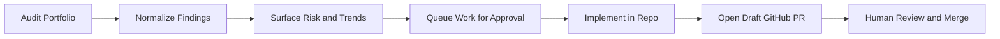

Back Office demonstrates:

- **Portfolio awareness** across many repos and departments.
- **Structured observability** through scores, backlog history, queue state, and delivery metadata.
- **Operator control** through explicit approval steps.
- **Responsible AI usage** where AI assists judgment without replacing accountability.

### What Makes It Credible

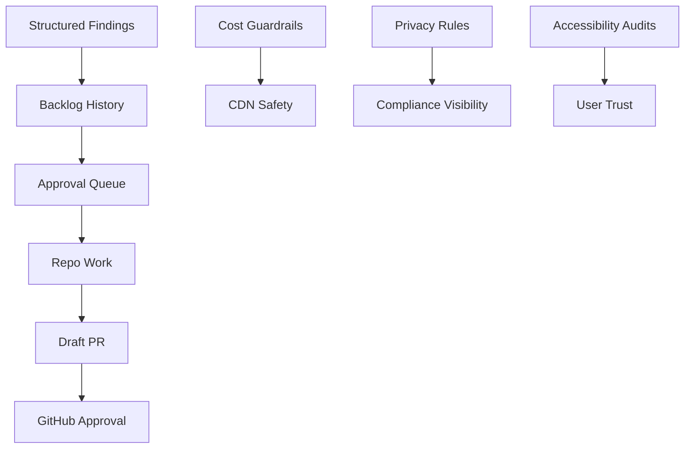

The system is credible because it combines:

- **Real artifacts**: JSON findings, queue payloads, score history, audit logs, and published dashboards.
- **Clear boundaries**: approval before execution, draft PR before merge, GitHub review before production.
- **Operational discipline**: CDN cost guardrails, per-product isolation, auditable status transitions.
- **Human-centered framing**: recommendations are visible and attributable, not silent background behavior.

The current code backs that story directly:

- `backoffice/workflow.py` runs audits and refreshes dashboard artifacts
- `backoffice/aggregate.py` builds department payloads and summary views
- `backoffice/backlog.py` deduplicates findings and tracks recurrence
- `backoffice/tasks.py` persists queue state and queue history
- `backoffice/server.py` exposes local operator APIs for audits and approvals
- `backoffice/sync/engine.py` publishes dashboard assets with bounded CDN invalidation

[Back to top](#table-of-contents)

---

## Operating Model

### End-to-End Flow

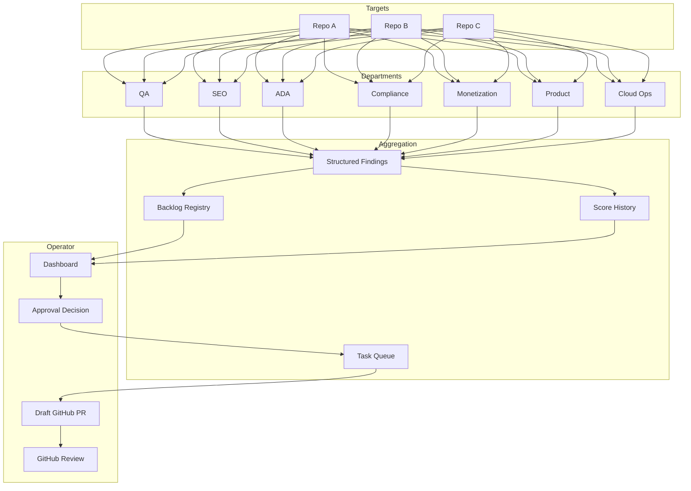

At a high level:

1. Department agents scan each configured repo.
2. Findings are normalized into a common schema.
3. The backlog records recurrence, timestamps, severity, and current state.
4. The dashboard surfaces scores, findings, and queue status.
5. A person can click a finding and queue it for approval.
6. Approved work moves into the task queue as actionable engineering work.
7. Work can progress to a draft GitHub PR that still requires GitHub approval.

The refresh path in code is concrete:

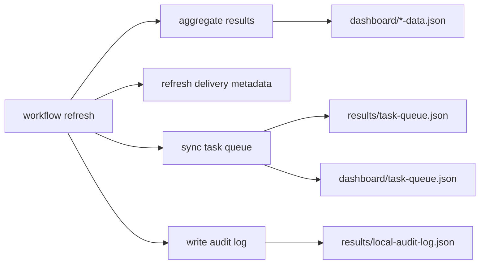

### Departments

| Department | Primary question |
|---|---|
| **QA** | What is broken, risky, slow, or fragile? |
| **SEO** | What hurts discoverability, indexability, and metadata quality? |
| **ADA** | What blocks accessibility and WCAG conformance? |
| **Compliance** | What creates privacy, legal, or policy exposure? |
| **Monetization** | What commercial opportunities are visible without degrading trust? |
| **Product** | What product gaps, workflow issues, or roadmap moves should be considered? |
| **Cloud Ops** | What infrastructure, cost, reliability, or Well-Architected issues matter now? |

### Objective vs Advisory Work

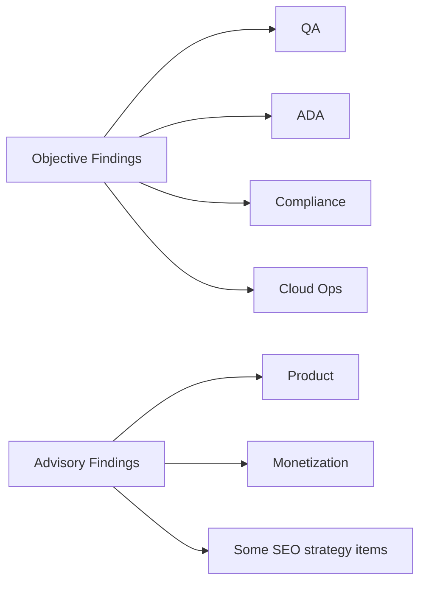

Back Office distinguishes between:

- **Objective work**: issues that can be checked against standards, tests, or concrete implementation facts.
- **Advisory work**: suggestions that still benefit from human judgment and product context.

That distinction is **a schema-level field on every finding** (`trust_class`,
values `objective` or `advisory`). `backoffice.backlog.normalize_finding`
stamps it from the department by default (QA/ADA/compliance/privacy/cloud-ops
→ objective; product/monetization/SEO → advisory) and agents may override
per-finding via `raw['trust_class']`. The field threads through to
`backlog.json`, the aggregate payload (`trust_class_totals`,
`trust_class_counts`), and the Product Owner’s prioritisation — so the queue
can move objective findings into approval quickly while advisory items stay
framed as deliberate product decisions.

[Back to top](#table-of-contents)

---

## Dashboard

The dashboard is the product’s strongest surface. It is where observability and operator control meet.

### What The Operator Sees

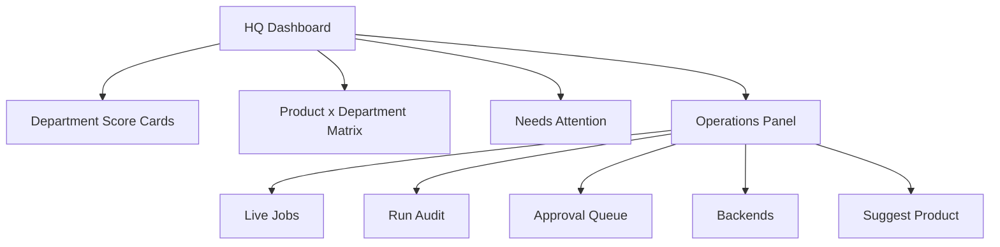

Core dashboard surfaces:

| Surface | Why it matters |
|---|---|
| **Score cards** | Show portfolio health and recent movement by department |
| **Matrix** | Lets an operator drill into one product and one discipline immediately |
| **Needs Attention** | Highlights the most important findings without asking the operator to hunt |
| **Finding detail** | Shows evidence, impact, file path, recurrence, and next action |
| **Approval Queue** | Shows what is waiting for a human decision, what is ready, and what is in GitHub review |

### How Findings Become Queue Items

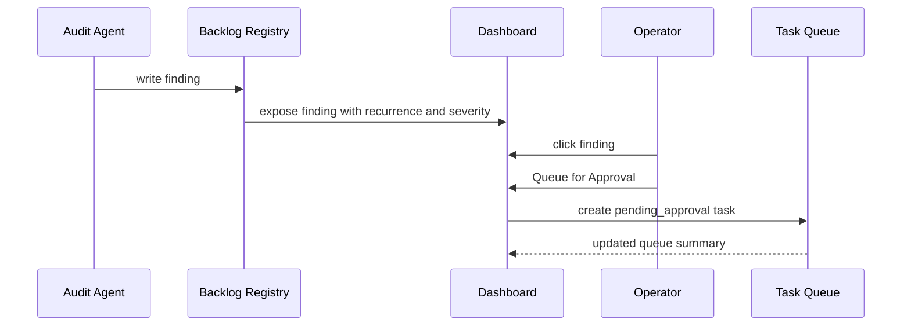

A finding detail panel shows:

- title
- severity
- repo
- department
- description
- evidence
- impact
- file and line
- recommended fix
- backlog recurrence history
- queue action for approval

That means a finding is not just a static observation. It is immediately operational.

### Approval Queue

The approval queue is where work becomes governable.

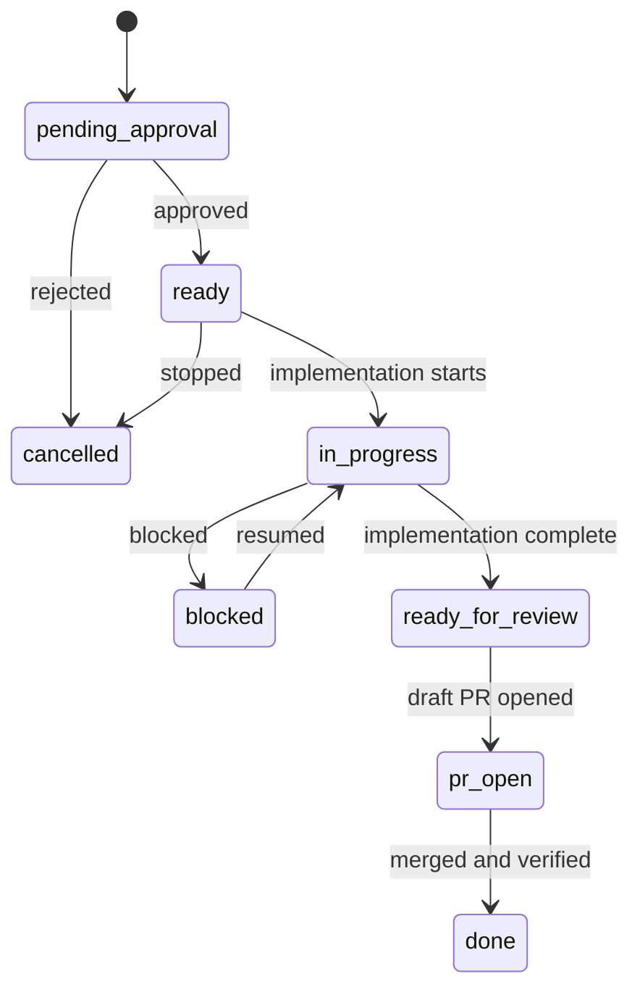

The queue is designed to answer:

- what is awaiting approval
- what has been approved but not started
- what is actively in progress
- what is blocked
- what is ready for review
- what already has a draft PR open

It also reports counts by product so backlog numbers remain isolated instead of crossing products.

Current queue states implemented in code:

- `pending_approval`
- `proposed`
- `approved`
- `ready`
- `queued`
- `in_progress`
- `blocked`
- `ready_for_review`
- `pr_open`
- `done`
- `cancelled`

### GitHub Review Path

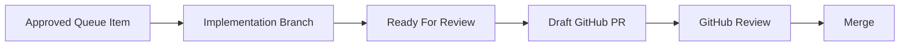

This keeps the human in the loop in two separate places:

1. **approval to do the work**
2. **approval to merge the work**

Back Office can help create the branch and draft PR context, but GitHub remains the formal review gate.

[Back to top](#table-of-contents)

---

## Quick Start

### 1. Install

```bash
git clone https://github.com/CodyJo/back-office.git
cd back-office
make setup
```

Prerequisites:

- Python 3.12+
- Git
- Bunny Storage API key for dashboard publishing (see `config/backoffice.bunny.example.yaml`)
- Claude CLI and/or Codex if you want AI-backed repo work
- GitHub CLI (`gh`) if you want draft PR creation from the approval flow

### 2. Configure Targets

```bash
cp config/backoffice.example.yaml config/backoffice.yaml
```

`config/backoffice.yaml` is the single source of truth: runtime config, dashboard
publish targets, backend routing, target map, **and per-target `autonomy:` policy
consumed by the overnight loop**. `config/targets.yaml` is **deprecated** (its
shell-consumer read path inside `overnight.sh` is still wired up, but no new
fields should go there). Run `python -m backoffice check-drift` to detect any
divergence between the two; CI and the overnight loop fail closed on drift.

Example target in `config/backoffice.yaml`:

```yaml
targets:
  my-app:
    path: /path/to/my-app
    language: typescript
    default_departments: [qa, seo, ada, compliance, monetization, product, cloud-ops]
    lint_command: "npm run lint"
    test_command: "npm test"
    coverage_command: "npm run test:coverage"
    deploy_command: "npm run build"
    context: |
      What the product does, who uses it, and what matters most.
    autonomy:                        # optional; conservative defaults apply
      allow_fix: true
      allow_feature_dev: false       # branch-only feature dev off
      allow_auto_commit: true
      allow_auto_merge: false        # merges require human review
      allow_auto_deploy: false
      require_clean_worktree: true
      require_tests: true
      max_changes_per_cycle: 3
      deploy_mode: disabled          # disabled | manual | staging-only | production-allowed
```

Gate evaluation is policy-as-data. Overnight.sh asks

```bash
python -m backoffice policy <repo> <gate> [--context worktree_clean=false]
```

where `<gate>` is one of `fix`, `feature_dev`, `auto_commit`, `auto_merge`,
`deploy`. Exit code `0` = allow, `1` = block, `2` = error; JSON stdout carries
the reason code.

### 3. Run Audits

```bash
make qa TARGET=/path/to/my-app
make audit-all-parallel TARGET=/path/to/my-app
python3 -m backoffice audit-all --targets my-app
```

### 4. Launch The Dashboard

```bash
python3 -m backoffice serve --port 8070
```

Then open `http://localhost:8070`.

### 5. Work The Queue

Typical operator flow:

1. Open a finding from `Needs Attention` or a department panel.
2. Review evidence, impact, and recurrence history.
3. Click `Queue for Approval`.
4. Move to the `Approval Queue` tab in Operations.
5. Approve or cancel the item.
6. After implementation, open a draft GitHub PR for formal review.

### 6. Publish Dashboard Assets

```bash
python3 -m backoffice sync
```

This publishes dashboard assets to Bunny Storage and purges the Bunny Pull Zone cache.

[Back to top](#table-of-contents)

---

## CLI And Make Targets

### Python CLI

All commands run through:

```bash
python3 -m backoffice <command>
```

Key commands:

| Command | Purpose |
|---|---|
| `audit <target>` | Run audits for one configured target |
| `audit-all` | Run audits across configured targets |
| `refresh` | Regenerate dashboard artifacts from existing results |
| `sync` | Publish dashboard artifacts |
| `serve --port 8070` | Start the local dashboard server |
| `list-targets` | Show configured targets |
| `tasks list` | Show queue items |
| `tasks show --id <task-id>` | Inspect one queue item |
| `tasks create --repo <repo> --title <title>` | Create a manual queue item |
| `tasks start/block/review/complete/cancel` | Advance queue state |
| `agents {list,show,create,pause,resume,retire}` | Agent registry CRUD |
| `routines {list,show,run,pause,resume}` | Routine CRUD + manual run |
| `budgets {list,spend,evaluate}` | Budget visibility + cost rollups |
| `tokens {issue,revoke,revoke-all,list}` | Per-agent API tokens |
| `runs {list,show}` | Inspect run records |
| `export [--out path]` | Deterministic export of operator-owned config |
| `import path [--apply] [--overwrite]` | Validate (and optionally apply) an export payload |
| `regression` | Run the regression suite |

The CLI routing in `backoffice/__main__.py` maps:

- `audit`, `audit-all`, `refresh`, `list-targets` -> `backoffice/workflow.py`
- `tasks ...` -> `backoffice/tasks.py`
- `sync` -> `backoffice/sync/engine.py`
- `serve` -> `backoffice/server.py`

### Make Targets

Audit and dashboard workflow:

| Target | Purpose |
|---|---|
| `make qa TARGET=/path` | QA scan |
| `make seo TARGET=/path` | SEO audit |
| `make ada TARGET=/path` | Accessibility audit |
| `make compliance TARGET=/path` | Compliance audit |
| `make monetization TARGET=/path` | Monetization audit |
| `make product TARGET=/path` | Product audit |
| `make cloud-ops TARGET=/path` | Cloud Ops audit |
| `make audit-all TARGET=/path` | Run all departments sequentially |
| `make audit-all-parallel TARGET=/path` | Run all departments in parallel waves |
| `make full-scan TARGET=/path` | Audit plus fix-agent pass |
| `make local-refresh` | Rebuild dashboard artifacts from current results |
| `make dashboard` | Publish dashboards |
| `make jobs` | Start the local dashboard server |
| `make test` | Run pytest |
| `make test-coverage` | Run pytest with coverage |
| `make smoke` | End-to-end agent loop smoke harness |
| `make smoke-claude-code` | Claude Code adapter wire-up + safety smoke (no real model call) |

### Local Server APIs

The local dashboard server exposes concrete JSON endpoints:

| Route | Method | Purpose |
|---|---|---|
| `/api/run-scan` | `POST` | Run one department against the current target repo |
| `/api/run-all` | `POST` | Run all departments against the current target repo |
| `/api/run-fix` | `POST` | Launch `agents/fix-bugs.sh` against a configured target (optional `preview: true`) |
| `/api/run-regression` | `POST` | Start regression runner |
| `/api/manual-item` | `POST` | Add a manual backlog item |
| `/api/ops/status` | `GET` | Fetch jobs, queue state, backend health, and targets |
| `/api/ops/backends` | `GET` | Fetch backend health and routing policy |
| `/api/ops/audit` | `POST` | Start an audit for a configured target |
| `/api/tasks` | `GET` | Fetch the queue payload |
| `/api/tasks/queue-finding` | `POST` | Queue a finding for approval |
| `/api/tasks/approve` | `POST` | Approve a queued item |
| `/api/tasks/cancel` | `POST` | Cancel a queued item |
| `/api/tasks/request-pr` | `POST` | Open a draft GitHub PR |
| `/api/ops/product/suggest` | `POST` | Submit a product suggestion |
| `/api/ops/product/approve` | `POST` | Approve a suggested product and add it to config |
| `/api/health` | `GET` | Liveness check (no auth) |
| `/api/agents` | `GET` | Agent registry snapshot |
| `/api/runs` | `GET` | Active + recent runs |
| `/api/audit-events` | `GET` | Last N structured audit events |
| `/api/tokens` | `GET` | List issued tokens (operator-only; hashes only) |
| `/api/tokens/issue` | `POST` | Issue a per-agent token (operator-only; plaintext returned once) |
| `/api/tokens/revoke` | `POST` | Revoke by `token`, `token_hash`, or `agent_id` (operator-only) |
| `/api/tasks/<id>/checkout` | `POST` | Atomic claim by an agent (Bearer agent token) |
| `/api/runs/<id>/log` | `POST` | Agent appends a structured log entry |
| `/api/runs/<id>/cost` | `POST` | Agent records a `CostEvent` |
| `/api/runs/<id>/ready-for-review` | `POST` | Agent declares the run done |
| `/api/runs/<id>/cancel` | `POST` | Agent cancels its own run |
| `/api/approvals/request` | `POST` | Request an approval (agent or operator) |
| `/api/approvals/<id>/decide` | `POST` | Decide an approval (operator-only) |

### Dashboard Run Panel

The dashboard's **Run** button (top-right) drives `backoffice.api_server`
directly so operators can trigger scans and fixes from the browser.

Setup:

1. Generate an API key: `openssl rand -hex 24`
2. Add to `config/backoffice.yaml`:

   ```yaml
   api:
     port: 8071
     api_key: <your-key>
     allowed_origins:
       - https://admin.codyjo.com
       - http://localhost:8070
   ```

3. Start the API server: `python3 -m backoffice api-server --bind 0.0.0.0 --port 8071`
4. In the dashboard, click **Run**, paste the key when prompted (stored
   per-browser under `localStorage['bo.api_key']`).

The server refuses to start on a non-loopback bind without a key. Use
**Preview mode (recommended)** on the Fix section — it lands changes on
an isolated branch for review instead of editing `main` on the target.

[Back to top](#table-of-contents)

---

## Control Plane

The control plane is the typed layer that sits beneath the existing
audit + queue + dashboard surface. Every actor that does work in the
system is a registered agent with identity, status, and a budget;
every action is a `Run` with explicit lifecycle; every mutation
emits a structured audit event. Existing flows continue to work
unchanged — these primitives are additive.

```mermaid
flowchart LR
    OP[Operator] -->|approve| TASK[Task]
    OP -->|issue token| AGENT[Agent registry]
    AGENT -->|Bearer token| API[/api/tasks/<id>/checkout]
    API --> CHECKOUT[Atomic checkout]
    CHECKOUT --> RUN[Run record]
    RUN --> ADAPTER[Adapter invoke]
    ADAPTER --> RESULT{Result}
    RESULT -->|succeeded| READY[/api/runs/<id>/ready-for-review]
    READY --> REVIEW[Task: ready_for_review]
    REVIEW -->|operator| PR[/api/tasks/request-pr]
    PR --> GH[Draft GitHub PR]
    RUN -->|cost| LEDGER[results/cost-events.jsonl]
    LEDGER --> BUDGETS[Budget evaluation]
    BUDGETS -->|hard limit| BLOCK[Checkout 402]
    AGENT --> AUDIT[results/audit-events.jsonl]
    CHECKOUT --> AUDIT
    READY --> AUDIT
```

### Concepts

| Concept | Owner | Persistence |
|---|---|---|
| **Agent** | `backoffice.agents.AgentRegistry` | `results/agents/<id>.json` |
| **Task** | `backoffice.tasks` (legacy) + `backoffice.store.transition_task` (typed) | `config/task-queue.yaml` |
| **Run** | `backoffice.store.FileStore.checkout_task` / `create_run` | `results/runs/<id>.json` |
| **Approval** | `backoffice.agent_api.handle_request_approval` / `handle_decide_approval` | Audit log (events) + `task["approval"]` |
| **Adapter** | `backoffice.adapters.{noop,process,legacy_backend,claude_code}` | code |
| **Budget** | `backoffice.budgets` | `config/backoffice.yaml` (`budgets:`) |
| **CostEvent** | `backoffice.budgets.record_cost` | `results/cost-events.jsonl` |
| **Routine** | `backoffice.routines.Scheduler` | `results/routines/<id>.json` |
| **Workspace** | `backoffice.workspaces.WorkspaceRegistry` | `results/workspaces/<id>.json` |
| **AuditEvent** | every mutating call | `results/audit-events.jsonl` (rotates at 10 MiB) |
| **Token** | `backoffice.auth` | `results/agent-tokens.json` (SHA-256 hashes only) |

### Configuration

`config/backoffice.yaml` has new optional blocks (validated at load
time via `validate_extensions`):

```yaml
agents:
  fix-agent:
    role: fixer
    adapter_type: process
    adapter_config:
      command: "bash agents/fix-bugs.sh"
      env_allowlist: [PATH, HOME]
      timeout_seconds: 1800

routines:
  hourly-portfolio-audit:
    name: Hourly portfolio audit
    trigger_kind: cron
    trigger:
      interval_seconds: 3600
    action_kind: noop
    budget_id: global-monthly

budgets:
  - id: global-monthly
    scope: global
    period: monthly
    soft_limit_usd: 50
    hard_limit_usd: 100
  - id: fix-agent-day
    scope: agent
    scope_id: fix-agent
    period: daily
    hard_limit_usd: 5

plugins:
  - name: my-adapter
    extension_point: adapter
    path: /opt/backoffice-plugins/my_adapter.py
    attribute: MyAdapter
```

### Operator workflow

1. Add the relevant block to `config/backoffice.yaml`.
2. Reconcile the registry: `python -m backoffice agents create ...`
   or rely on automatic sync via `agents.sync_from_config()` (called
   wherever the config is loaded — e.g. setup wizard).
3. Issue a token: `python -m backoffice tokens issue --agent-id agent-fix`.
4. Run the smoke harness: `make smoke && make smoke-claude-code`.
5. The dashboard's **Control plane** section (Agents · Recent runs ·
   Activity · Tokens) shows live state.

### Safety guarantees

- Concurrent task checkout is atomic — exactly one of N parallel
  agents wins; the others receive a structured `CheckoutConflict`.
- Cross-agent mutations are denied at the auth layer; an agent
  cannot log against, cancel, or report cost on another agent's run.
- The Claude Code adapter refuses to invoke without an `approval_id`
  on the run, refuses against any path in its `refuse_against` list,
  and respects `dry_run`.
- Operator-only actions (decide approval, issue/revoke token) require
  the operator API key — agent tokens cannot impersonate.
- Hard-limit budgets return HTTP 402 from `/api/tasks/<id>/checkout`
  before any work begins; soft limits warn and audit-log.
- Every state mutation appends one structured event to
  `results/audit-events.jsonl`. The legacy `task["history"]` list is
  preserved for backwards compatibility.

See:

- [Task Lifecycle](docs/task-lifecycle.md) — state diagram, transitions, audit guarantees
- [Agents](docs/agents.md) — registration, roles, agent HTTP API
- [Adapters](docs/adapters.md) — adapter contract + built-ins
- [Security](docs/security.md) — trust model, auth, secret handling
- [Budgets](docs/budgets.md) — cost recording + time-windowed evaluation
- [Claude Code Adapter](docs/claude-code-adapter.md) — runbook and safety rules
- [Architecture docs](docs/architecture/) — current state, target state, phased roadmap

[Back to top](#table-of-contents)

---

## Architecture

### System Topology

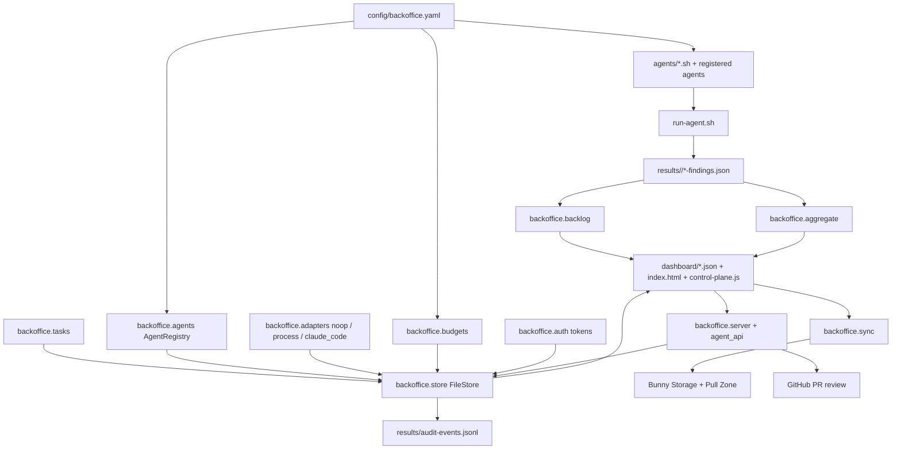

### Core Data Artifacts

| Artifact | Role |
|---|---|
| `results/<repo>/*-findings.json` | Raw department output |
| `dashboard/*-data.json` | Dashboard-ready department payloads |
| `dashboard/backlog.json` | Persistent finding registry with recurrence |
| `dashboard/score-history.json` | Trend history for sparkline rendering |
| `dashboard/agents-data.json`, `dashboard/runs-data.json`, `dashboard/audit-events.json` | Control-plane payloads consumed by `control-plane.js` |
| `config/task-queue.yaml` | Source-of-truth task queue |
| `results/task-queue.json` | Machine-readable queue payload |
| `dashboard/task-queue.json` | Frontend-facing queue payload |
| `results/local-audit-log.json` | Audit log and target snapshot data |
| `results/audit-events.jsonl` | Append-only structured audit log of every state mutation across the system; rotates at 10 MiB |
| `results/cost-events.jsonl` | Recorded AI execution cost events (estimated by default, verified when adapters report) |
| `results/runs/<run-id>.json` | Per-run records (Phase 3 atomic checkout output) |
| `results/agents/<id>.json` | Registered agent records |
| `results/workspaces/<id>.json` | Tracked branches / worktrees |
| `results/routines/<id>.json` | Scheduled routine records |
| `results/agent-tokens.json` | Hashed per-agent API tokens — plaintext never persisted |
| `results/.locks/*.lock` | POSIX advisory locks for atomic queue mutations |
| `results/overnight-ledger.jsonl` | Append-only JSONL audit trail of every gate decision, skip, rollback, or deploy (written by the overnight loop; never rotated in place) |
| `results/overnight-history.json` | Last 50 cycle summaries — used to compute the failure-memory window and quarantine streaks |
| `results/quarantine-clear.json` | Operator override: `{"cleared": ["repo-a", ...]}` clears a repo back into rotation |

### Key Files

| File | Purpose |
|---|---|
| `backoffice/workflow.py` | Audit orchestration and refresh flow |
| `backoffice/aggregate.py` | Findings aggregation into dashboard payloads |
| `backoffice/backlog.py` | Finding normalization, trust-class stamping, recurrence tracking |
| `backoffice/policy.py` | Per-target autonomy gates (policy-as-data, JSON + exit codes) |
| `backoffice/config_drift.py` | Detects drift between `backoffice.yaml` and legacy `targets.yaml` |
| `backoffice/overnight_state.py` | Execution ledger, failure-memory backoff, per-repo quarantine |
| `backoffice/tasks.py` | Approval queue model and queue lifecycle |
| `backoffice/server.py` | Dashboard server, approval APIs, agent endpoint dispatch |
| `backoffice/agent_api.py` | Phase 9 agent-facing endpoint handlers (checkout, run log, cost, ready-for-review, approvals) |
| `backoffice/agents.py` | Agent registry CRUD + config sync |
| `backoffice/adapters/` | `noop`, `process`, `legacy_backend`, `claude_code` adapters + adapter contract |
| `backoffice/auth.py` | Per-agent API tokens (issue / authenticate / revoke / scopes) |
| `backoffice/budgets.py` | Cost recording + time-windowed budget evaluation (daily / weekly / monthly / rolling_24h / lifetime) |
| `backoffice/routines.py` | Routine + Scheduler with manual / cron / event triggers |
| `backoffice/workspaces.py` | Workspace lifecycle + `pr_body()` provenance renderer |
| `backoffice/portable.py` | Deterministic export with secret redaction; dry-run import |
| `backoffice/plugins.py` | Experimental plugin loader (config-registered) |
| `backoffice/store/` | `FileStore`, atomic write helpers, `LockFile`, `transition_task`, `checkout_task` |
| `backoffice/domain/` | Typed models + state machines for Task / Run / Approval |
| `backoffice/audit_rotation.py` | JSONL rotation when over 10 MiB |
| `backoffice/__main__.py` | CLI routing |
| `dashboard/index.html` | Main control-plane UI |
| `dashboard/control-plane.js` | Agents / Runs / Activity / Tokens cards |
| `scripts/smoke-agent-loop.py` | End-to-end agent lifecycle smoke (`make smoke`) |
| `scripts/smoke-claude-code.py` | Claude Code adapter wire-up smoke (`make smoke-claude-code`) |
| `Makefile` | Operator shortcuts for audits, serving, sync, tests, smoke |
| `scripts/sync-dashboard.sh` | Dashboard publishing entrypoint |
| `docs/WORKFLOW-ARCHITECTURE.md` | Detailed architecture doc |
| `docs/CICD-REFERENCE.md` | Delivery and GitHub review model |
| `docs/COST_GUARDRAILS.md` | CDN and infrastructure cost controls |
| `docs/architecture/` | Phase docs: current-state, target-state, phased-roadmap |
| `docs/task-lifecycle.md` | Task state machine, transitions, audit guarantees |
| `docs/agents.md` | Agent registry + agent HTTP API |
| `docs/adapters.md` | Adapter contract + built-ins |
| `docs/security.md` | Trust model, auth, secret handling |
| `docs/budgets.md` | Cost tracking + time-windowed budget evaluation |
| `docs/claude-code-adapter.md` | Claude Code adapter runbook |

[Back to top](#table-of-contents)

---

## CI/CD

Back Office uses Bunny Magic Container for CI and CD and relies on GitHub review for pull request approval.

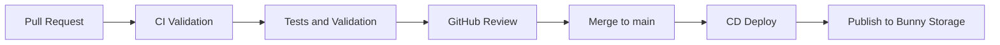

Current posture:

- pull requests run validation gates (shell syntax, Python linting, pytest)
- merges to `main` run deployment gates
- dashboard publishing goes to Bunny Storage with Pull Zone cache purge
- draft PR creation from the dashboard still terminates in normal GitHub review

[Back to top](#table-of-contents)

---

## Governance

Back Office is governed by three non-negotiable ideas:

1. **Privacy first**
2. **Human-centered AI**
3. **Operational safety**

That means:

- AI suggestions are visible and attributable.
- People approve meaningful changes.
- GitHub remains a real review boundary.
- Accessibility and compliance findings are treated as serious operating work.
- Cost-sensitive infrastructure behavior is controlled deliberately.

See [MASTER-PROMPT.md](MASTER-PROMPT.md) for the full operating rules.

[Back to top](#table-of-contents)

---

## Docs

Core documentation:

- [Workflow Architecture](docs/WORKFLOW-ARCHITECTURE.md)
- [CI/CD Reference](docs/CICD-REFERENCE.md)
- [Cost Guardrails](docs/COST_GUARDRAILS.md)
- [Compliance Controls](docs/COMPLIANCE-CONTROLS.md)
- [Live URLs](docs/LIVE-URLS.md)

[Back to top](#table-of-contents)

---

## Handoff

Continuation notes and current implementation state live in [docs/HANDOFF.md](docs/HANDOFF.md).

[Back to top](#table-of-contents)
